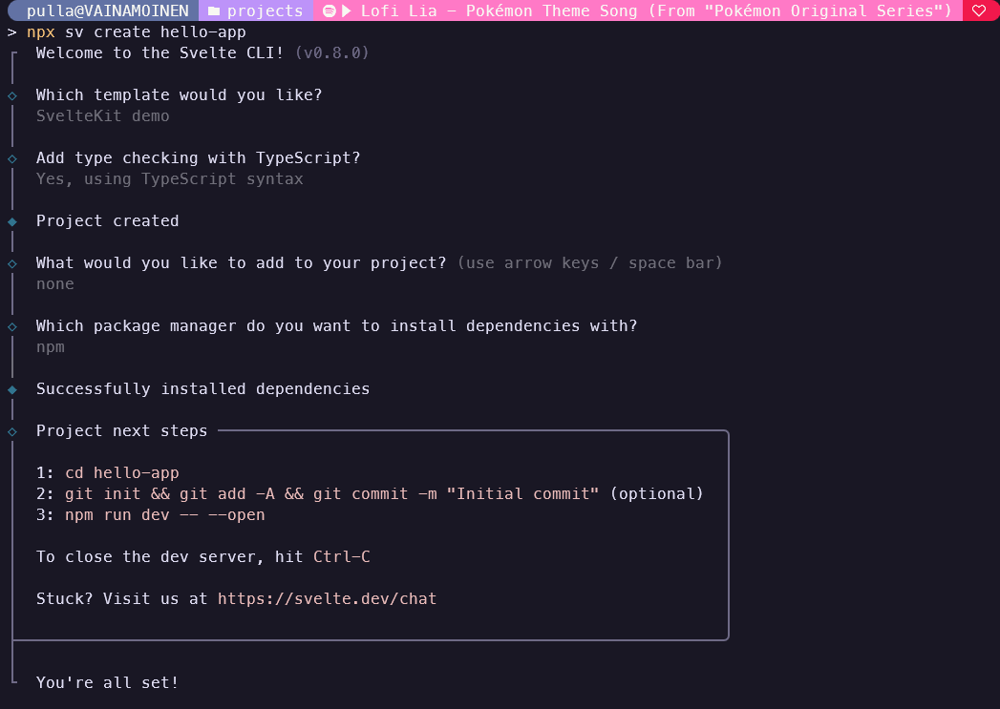
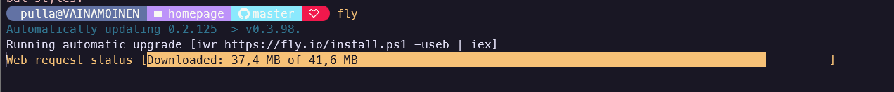
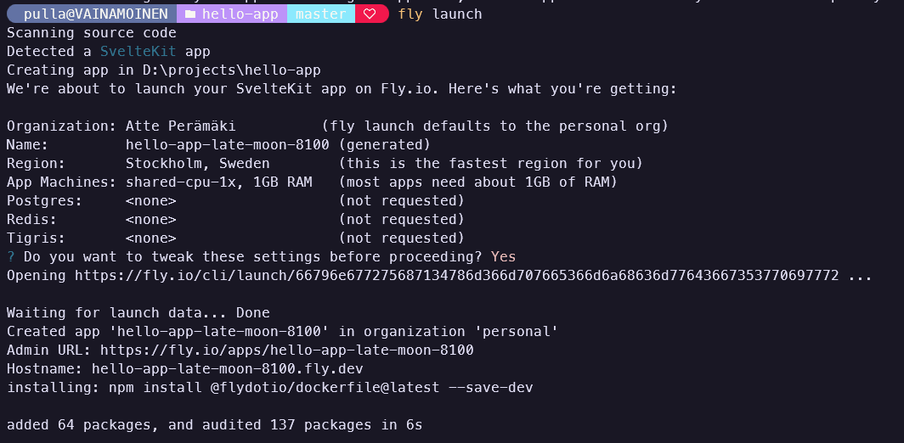
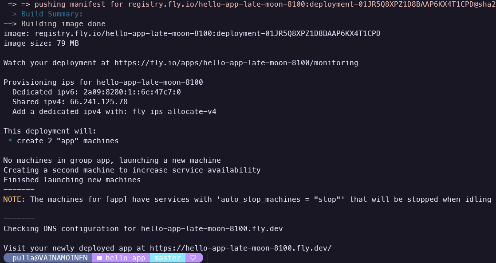
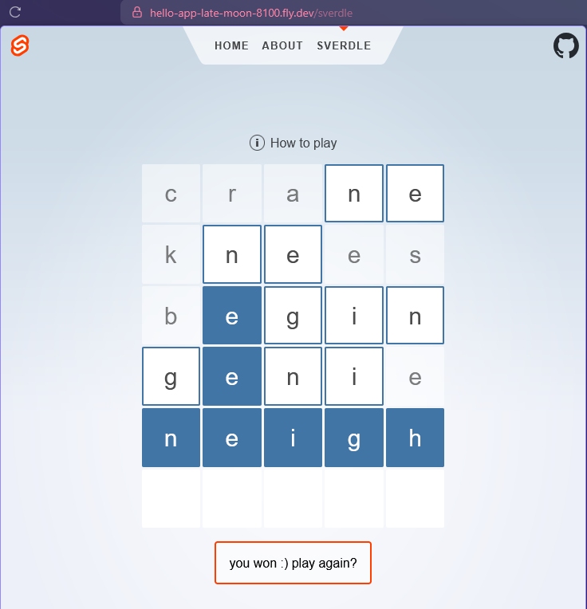

# Cloudservices course diary

## Table of contents

- [x] [ Week 1 - Fly.io](#week-1---flyio)
- [x] [ Free choice extra assignment E - Github pages](#free-choice-extra-assignment-bundle-e) 

## Week 1 - Fly.io
> **Or implement some basic application to Fly.io PaaS. This requires some basic programming and IT skills:**
>
> Fly.io assignment options:
>
> - Do this [hands-on tutorial](https://fly.io/docs/hands-on/) and install that ready docker container provided (or use your own Docker application)
>
> or do this:
>
> - Implement your own NodeJS app with [these instructions](https://fly.io/docs/languages-and-frameworks/node/)
>
> or do this:
>
> - Implement your own Python app with [these instructions](https://fly.io/docs/languages-and-frameworks/python/)
>
> - From your work:
>
> Document your work progress with few screenshots to the learning diary. Code samples, views from web browser etc. Usually few screenshots are enough to prove the assignment done. Note: Do not include any API keys, authentication tokens, passwords and such to the screenshots
> Alternatively: Record a short screencast demo video (with OBS or whatever recording software you prefer) about your app running in the internet and upload it to the Youtube (or some other video service) as unlisted video where hidden link points to your demo video, and no login is required, but video is not necessary completely public. Keep the video there until you have received your course grade. Write the video address to the learning diary so that your peer reviewers can verify it easily
>

I decided to push Svelte demo project to fly.io. Therefore I needed to follow Svelte guidance[^2]. I immediately ran into problems, as command to initialize Svelte project proposed in the guide is not in use anymore. I referred to Sveltekit official guide[^3].

 Svelte uses adapters to allow it to run on multiple backends. I installed it with `npm i -D @sveltejs/adapter-node` and then added `import adapter from '@sveltejs/adapter-node';` to `svelte.config.js` file, replacing `adapter-auto`. Fly cli tool was also already installed but out of date so running `fly` on terminal updated it.

[^2]: [Fly.io Svelte guide](https://fly.io/docs/js/frameworks/svelte/)
[^3]: [Svelte getting started guide](https://svelte.dev/docs/svelte/getting-started)

Next step is to run `fly launch`. This presented an option to change default settings. I chose to change App machine to cheaper (256mb RAM). This took a while and logs are quite long. Following two images cut the middle part.

Now site is available at [random url](https://hello-app-late-moon-8100.fly.dev/). There is simple counter, about page and Wordle clone you can test.

> [!IMPORTANT]
> To save money, app goes offline if not used in long time. If you don't get page on first try, try refreshing after few seconds.

## Free choice extra assignment bundle E

> 
> Use Github Pages and use markdown language syntax (not HTML) to create a static website. Maybe you can host some WASM application there such as x86 emulation, Qt for WASM, or just Awesome WebAssembly Applications. However, just a static website is also fine:
> 
>         Website must be public
>         Use at least handful of Github flavour markdown features to format the web page
>         Document your work progress with few screenshots to the learning diary
>         Write the Github page address to the learning diary so that your peer reviewers can verify it easily
>         Keep the pages available until you have received your course grade

I decided to create this learning diary as _Github page_. Each week will be done under their own header with table of contents at top of the page. To get site to be usable and benefical for me, I read through provided link to Github flavor markdown[^1] to get idea of what else is supported (and what to include to get task for this week completed). Below is list of features I used now and in later tasks if I remember to update it later.

- [x] Headings
- [x] Styling text
- [x] Quoting text
- [x] Quoting code
- [ ] Supported color models
- [x] Links
- [x] Section links
- [ ] Relative links
- [x] Custom anchors
- [x] Line breaks
- [x] Images
- [x] Lists
- [x] Task lists
- [ ] Mentioning people and teams
- [ ] Referencing issues and pull requests
- [ ] Referencing external resources
- [ ] Uploading assets
- [ ] Using emojis
- [x] Paragraphs
- [x] Footnotes
- [x] Alerts
- [ ] Hiding content with comments
- [ ] Ignoring Markdown formatting
- [ ] Disabling Markdown rendering

[^1]: [Github markdown docs](https://docs.github.com/en/get-started/writing-on-github/getting-started-with-writing-and-formatting-on-github/basic-writing-and-formatting-syntax)

I started by creating new public github repository. After cloning it, I added file `index.md` to it's root and folder `imgs` for images. I used extionsion [Markdown Preview Enhanced](https://marketplace.visualstudio.com/items/?itemName=shd101wyy.markdown-preview-enhanced) in VS code to get live preview on my work.

After I did these I pushed changes to Github and went to repository settings and enabled _Pages_.

This automatically created an _action_ that will be ran each time main branch is pushed to. After action was ran, page was made available at [default url](https://aperamaki.github.io/cloudservices/).

