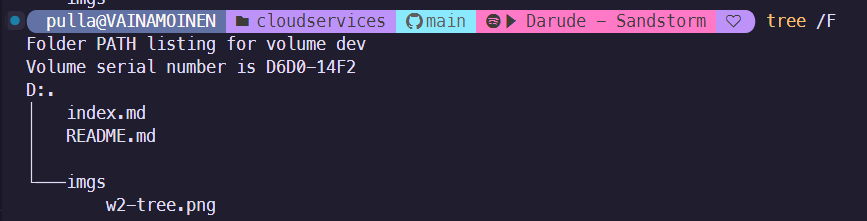
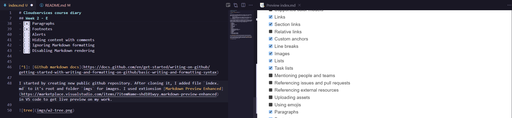
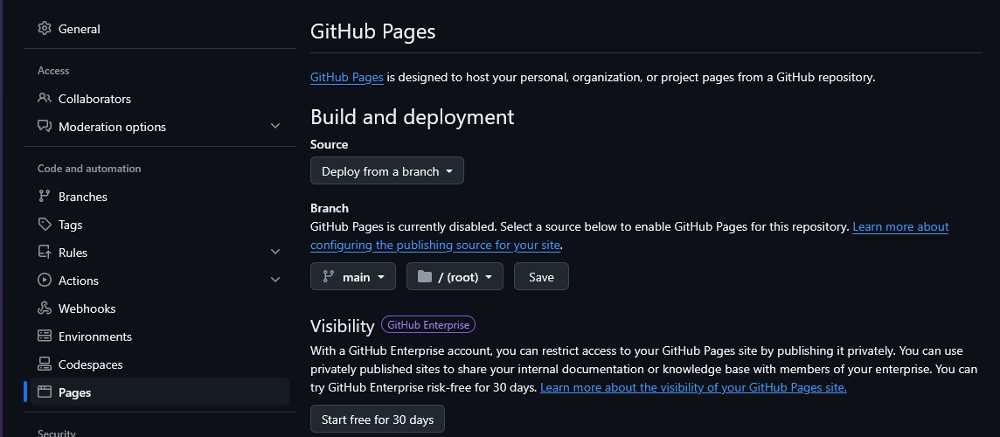
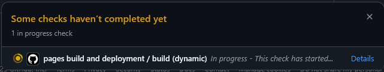

# Cloudservices course diary

## Table of contents

- [x] [Free choice extra assignment E - Github pages](#week-2---e) 

## Free choice extra assignment bundle E

> 
> Use Github Pages and use markdown language syntax (not HTML) to create a static website. Maybe you can host some WASM application there such as x86 emulation, Qt for WASM, or just Awesome WebAssembly Applications. However, just a static website is also fine:
> 
>         Website must be public
>         Use at least handful of Github flavour markdown features to format the web page
>         Document your work progress with few screenshots to the learning diary
>         Write the Github page address to the learning diary so that your peer reviewers can verify it easily
>         Keep the pages available until you have received your course grade

I decided to create this learning diary as _Github page_. Each week will be done under their own header with table of contents at top of the page. To get site to be usable and benefical for me, I read through provided link to Github flavor markdown[^1] to get idea of what else is supported (and what to include to get task for this week completed). Below is list of features I used now and in later tasks if I remember to update it later.

- [x] Headings
- [x] Styling text
- [x] Quoting text
- [x] Quoting code
- [ ] Supported color models
- [x] Links
- [x] Section links
- [ ] Relative links
- [x] Custom anchors
- [x] Line breaks
- [x] Images
- [x] Lists
- [x] Task lists
- [ ] Mentioning people and teams
- [ ] Referencing issues and pull requests
- [ ] Referencing external resources
- [ ] Uploading assets
- [ ] Using emojis
- [x] Paragraphs
- [x] Footnotes
- [ ] Alerts
- [ ] Hiding content with comments
- [ ] Ignoring Markdown formatting
- [ ] Disabling Markdown rendering

[^1]: [Github markdown docs](https://docs.github.com/en/get-started/writing-on-github/getting-started-with-writing-and-formatting-on-github/basic-writing-and-formatting-syntax)

I started by creating new public github repository. After cloning it, I added file `index.md` to it's root and folder `imgs` for images. I used extionsion [Markdown Preview Enhanced](https://marketplace.visualstudio.com/items/?itemName=shd101wyy.markdown-preview-enhanced) in VS code to get live preview on my work.

After I did these I pushed changes to Github and went to repository settings and enabled _Pages_.

This automatically created an _action_ that will be ran each time main branch is pushed to. After action was ran, page was made available at [default url](https://aperamaki.github.io/cloudservices/).

